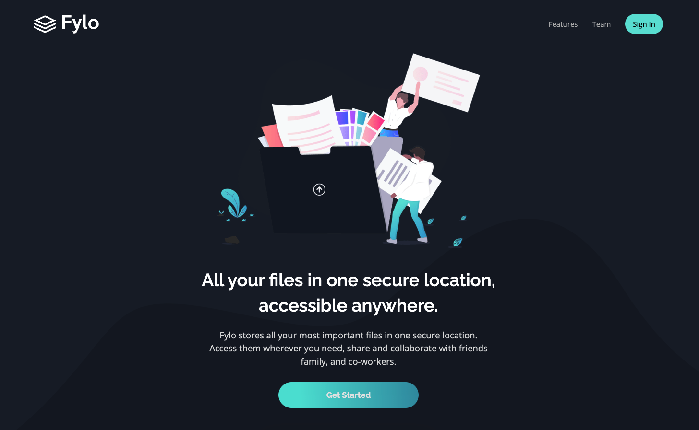
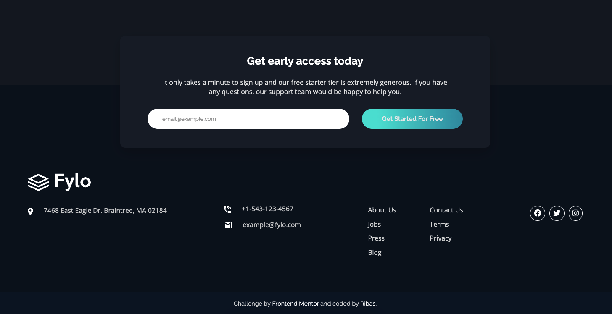

<h3 align="center">Fylo Landing Page in React</h3>

Here's another challenge from <a href="https://frontendmentor.io/">FrontendMentor</a>! I've made this project using ReactJS and SCSS. 

It's the first version, so there are still some improvements to be made. If you want to see how it's going, <a href="https://ribas-fylopage.netlify.app/">click me</a>.

<b>Here are some pictures of the project:</b>
 

